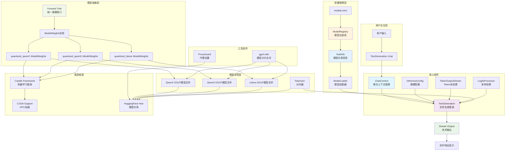

# candle-llm-chat

基于 [Candle](https://github.com/huggingface/candle) 框架的 Rust LLM 聊天库，支持 GGUF 量化模型、流式输出和 GPU 加速。

## ✨ 特性

- 🎯 **简洁 API**: 字符串标识符选择模型 `"qwen3"` / `"qwen3.W3_14b"`
- 🤖 **多模型支持**: Qwen2/Qwen3/Llama 系列，通过 `models.toml` 配置
- 📡 **流式输出**: 实时打字机效果
- 🚀 **GPU 加速**: CUDA 支持
- ⚡ **异步设计**: 基于 Tokio
- 🧠 **智能上下文**: 自动角色切换和思考过程过滤

## 🚀 快速开始

### 环境要求

- Rust 工具链 (推荐最新稳定版)
- CUDA 工具包 (可选，用于 GPU 加速)
- `gguf-utils` (可选，用于分片模型合并): `cargo install gguf-utils`

### 安装

```bash
git clone https://github.com/your-username/candle-llm-chat.git
cd candle-llm-chat
```

### 基本使用

```rust
use candle_llm_chat::pipe::TextGeneration;
use futures_util::{StreamExt, pin_mut};

// 使用默认模型 (Qwen3-8B)
let mut text_gen = TextGeneration::default().await?;

let stream = text_gen.chat("你好");
pin_mut!(stream);

while let Some(Ok(token)) = stream.next().await {
    print!("{}", token);
}
```

### 运行测试

```bash
# 交互式聊天
cargo test --lib pipe::tests::test_pipeline -- --nocapture

# 预设对话
cargo test --lib pipe::tests::test_prompt -- --nocapture
```

### 代理设置 (可选)

下载 Hugging Face 模型时可能需要代理：

```rust
use candle_llm_chat::utils::proxy::ProxyGuard;

let _proxy = ProxyGuard::new(7890); // 自动清理的代理设置
```

## ⚙️ 配置与使用

### 选择模型

```rust
// 使用架构默认模型
let text_gen = TextGeneration::with_default_config("qwen2").await?;

// 使用特定模型变体
let text_gen = TextGeneration::with_default_config("qwen3.W3_14b").await?;
let text_gen = TextGeneration::with_default_config("llama.DeepseekR1Llama8b").await?;
```

### 自定义推理参数

```rust
use candle_llm_chat::model::config::InferenceConfig;

let mut config = InferenceConfig::default();
config.temperature = 0.7;        // 控制随机性
config.sample_len = 2000;        // 最大生成长度
config.repeat_penalty = 1.1;     // 重复惩罚

let mut text_gen = TextGeneration::new("qwen3", config).await?;
```

### 配置文件

**`models.toml`** - 模型仓库配置：

```toml
[qwen3.W3_8b]
model_repo = "Qwen/Qwen3-8B-GGUF"
model_file = "Qwen3-8B-Q4_K_M"
tokenizer_repo = "Qwen/Qwen3-8B"
default = true
```

**`config.toml`** - 全局配置 (HuggingFace token 等)

## 🏗️ 项目架构



### 核心设计

**配置驱动**: 通过 `models.toml` 管理模型，字符串标识符选择 (`"qwen3"` 或 `"qwen3.W3_14b"`)

**统一接口**: `Forward` trait 抽象所有模型推理，通过宏自动实现

**异步优先**: 模型加载和推理全异步，基于 Tokio 和 async-stream

## 扩展新模型

添加新模型变体只需在 `models.toml` 中配置：

```toml
[qwen3.W3_72b]
model_repo = "Qwen/Qwen3-72B-GGUF"
model_file = "Qwen3-72B-Q4_K_M"
tokenizer_repo = "Qwen/Qwen3-72B"
```

然后直接使用：

```rust
let text_gen = TextGeneration::with_default_config("qwen3.W3_72b").await?;
```

添加新架构需要在 `ModelLoader::load()` 中实现加载逻辑。

## 📝 许可证

本项目采用 MIT 许可证。详情请参阅 [LICENSE](LICENSE) 文件。
