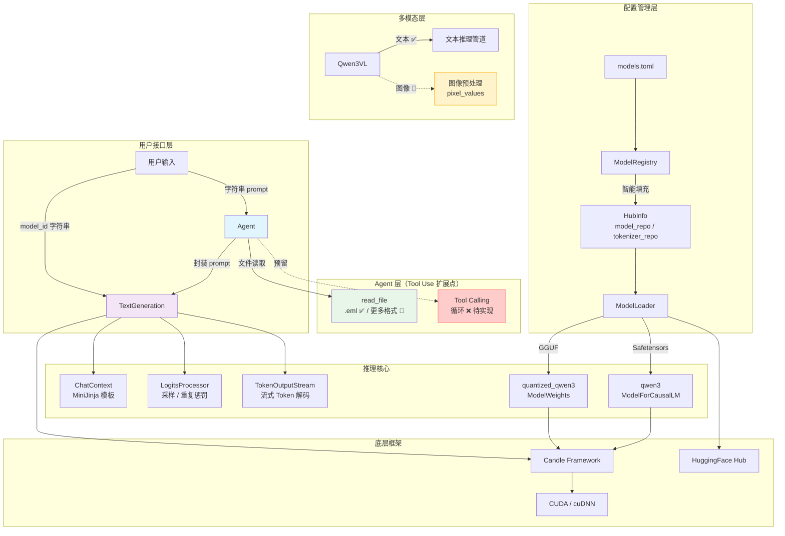

# candle-llm-chat

> 基于 [Candle](https://github.com/huggingface/candle) 框架的 **Rust 原生 LLM 聊天库**，支持 GGUF 量化模型、Safetensors 完整模型、流式输出、GPU 加速，以及多模态（Qwen3-VL）推理，并内置 Agent 扩展层。

[](https://www.rust-lang.org/)
[](https://github.com/huggingface/candle)
[](LICENSE)

---

## ✨ 特性

| 特性 | 说明 |
|------|------|
| 🎯 **简洁 API** | 字符串标识符选择模型，`"qwen3"` / `"qwen3.8b_q4"` |
| 🤖 **多模型支持** | Qwen3 系列（4B/8B/14B/32B），通过 `models.toml` 配置 |
| 📦 **双格式支持** | GGUF 量化模型 + Safetensors 完整模型，自动识别 |
| 📡 **流式输出** | 基于 `async-stream` 的实时 Token 流 |
| 🚀 **GPU 加速** | CUDA / cuDNN 支持 |
| ⚡ **异步设计** | 全栈 Tokio 异步，模型加载和推理均非阻塞 |
| 🧠 **聊天上下文** | MiniJinja 聊天模板渲染，思考过程自动过滤 |
| 🌍 **智能配置** | `tokenizer_repo` 自动填充，约定优于配置 |
| 🔭 **多模态** | Qwen3-VL 文本推理已就绪，图像输入接口预留 |
| 🤖 **Agent 层** | 内置 `Agent` 结构体，支持文件读取与 Tool Use 扩展 |

---

## 🚀 快速开始

### 环境要求

- Rust 工具链（推荐最新稳定版）
- CUDA 工具包（可选，用于 GPU 加速）
- `gguf-utils`（可选，用于分片 GGUF 模型合并）：`cargo install gguf-utils`

### 克隆项目

```bash
git clone https://github.com/your-username/candle-llm-chat.git
cd candle-llm-chat
```

### 环境变量（推荐先配置）

```powershell
# Windows PowerShell — 国内用户推荐设置 HuggingFace 镜像
$env:HF_ENDPOINT = "https://hf-mirror.com"

# 可选：HuggingFace Token（访问私有模型或提高速率限制）
$env:HF_TOKEN = "hf_your_token_here"
```

```bash
# Linux / macOS
export HF_ENDPOINT="https://hf-mirror.com"
export HF_TOKEN="hf_your_token_here"
```

### 基本使用

```rust
use candle_llm_chat::pipe::TextGeneration;
use futures_util::{StreamExt, pin_mut};

// 使用默认模型（当前为 qwen3.4b_base）
let mut gen = TextGeneration::default().await?;

let stream = gen.chat("你好，请介绍一下自己");
pin_mut!(stream);

while let Some(Ok(token)) = stream.next().await {
    print!("{}", token);
}
```

### 运行内置测试

```bash
# 交互式聊天（需要模型已下载）
cargo test --lib pipe::tests::test_pipeline -- --nocapture

# 预设 prompt 测试
cargo test --lib pipe::tests::test_prompt -- --nocapture
```

---

## ⚙️ 配置与使用

### 选择模型

```rust
// 架构默认模型（models.toml 中 default = true 的那个）
let gen = TextGeneration::with_default_config("qwen3").await?;

// 4B GGUF 量化模型（体积小、速度快）
let gen = TextGeneration::with_default_config("qwen3.4b_q4").await?;

// 8B Safetensors 完整模型（精度更高，需 GPU）
let gen = TextGeneration::with_default_config("qwen3.8b_base").await?;

// 自定义变体（去审查版本）
let gen = TextGeneration::with_default_config("qwen3.4b_abliterated").await?;
```

### 自定义推理参数

```rust
use candle_llm_chat::model::config::InferenceConfig;

let config = InferenceConfig {
    temperature: 0.7,       // 生成随机性（0.0 = 贪心，1.0 = 最随机）
    sample_len: 2000,       // 最大生成 Token 数
    repeat_penalty: 1.1,    // 重复惩罚系数
    ..Default::default()
};

let mut gen = TextGeneration::new("qwen3.8b_q4", config).await?;
```

### 使用 Agent 层

```rust
use candle_llm_chat::agent::Agent;
use futures_util::{StreamExt, pin_mut};
use std::path::Path;

// 普通对话
let mut agent = Agent::new().await?;
let stream = agent.chat("请用 Rust 写一个快速排序");
pin_mut!(stream);
while let Some(Ok(token)) = stream.next().await {
    print!("{token}");
}

// 基于文件内容提问（当前支持 .eml 格式）
let stream = agent.chat_with_file(
    Path::new("email.eml"),
    "这封邮件要我做什么？请简要总结"
)?;

// 多文件联合分析
let stream = agent.chat_with_files(
    &[Path::new("email1.eml"), Path::new("email2.eml")],
    "请总结这两封邮件的对话内容"
)?;
```

### 使用 Qwen3-VL（多模态文本推理）

```rust
use candle_llm_chat::qwen3_vl::Qwen3VL;
use candle::Device;

let device = Device::cuda_if_available(0)?;
let mut model = Qwen3VL::new(device).await?;

// 纯文本对话
let answer = model.chat("请描述一下量子纠缠的原理")?;
println!("{answer}");
```

> ⚠️ Qwen3-VL 图像输入接口已预留，图像预处理管线尚未实现，见[下一步计划](#-下一步计划roadmap)。

### 网络代理（可选）

```rust
use candle_llm_chat::utils::proxy::ProxyGuard;

// 自动清理的代理设置（Drop 时恢复原始环境变量）
let _proxy = ProxyGuard::new(7890);
```

---

## ⚙️ 模型配置（`models.toml`）

```toml
# 架构级配置节
[qwen3]

# Safetensors 完整模型（命名规范：*_base）
[qwen3.4b_base]
model_repo = "Qwen/Qwen3-4B-Instruct-2507"
default = true              # 架构默认模型

# GGUF 量化模型（命名规范：*_q4 / *_q8）
[qwen3.4b_q4]
model_repo = "byteshape/Qwen3-4B-Instruct-2507-GGUF"
model_file = "Qwen3-4B-Instruct-2507-Q4_K_S-3.66bpw.gguf"
# tokenizer_repo 自动从 qwen3.4b_base 获取，无需填写

# 自定义变体（需手动指定 tokenizer_repo）
[qwen3.4b_abliterated]
model_repo = "Goekdeniz-Guelmez/Josiefied-Qwen3-4B-abliterated-v2"
tokenizer_repo = "Goekdeniz-Guelmez/Josiefied-Qwen3-4B-abliterated-v2"
```

### 智能配置规则

| 规则 | 说明 |
|------|------|
| **自动格式识别** | 仓库名含 `"GGUF"` 自动识别为量化模型 |
| **tokenizer 自动填充** | `*_base` 使用自身 `model_repo`；其他变体从同架构的 `*_base` 继承 |
| **分片模型** | 自动检测 `model.safetensors.index.json`，按需下载所有分片 |
| **命名约定** | `架构.大小_变体`，如 `qwen3.8b_q4`、`qwen3.14b_base` |

### 添加新模型变体

只需在 `models.toml` 中追加配置，无需修改代码：

```toml
# 添加 32B GGUF 量化模型
[qwen3.32b_q4]
model_repo = "Qwen/Qwen3-32B-GGUF"
model_file = "Qwen3-32B-Q4_K_M.gguf"
```

---

## 🏗️ 项目架构

```
candle-llm-chat/
├── src/
│   ├── lib.rs              # 库入口，pub mod 声明
│   ├── pipe.rs             # TextGeneration 核心推理管道（流式）
│   ├── agent.rs            # Agent 层：文件读取 + Tool Use 扩展点
│   ├── qwen3_vl.rs         # Qwen3-VL 多模态推理（文本已就绪）
│   ├── model/
│   │   ├── mod.rs          # ModelInference trait + impl_forward! 宏
│   │   ├── config.rs       # ModelLoader + InferenceConfig
│   │   ├── registry.rs     # ModelRegistry（models.toml 解析）
│   │   └── hub.rs          # HubInfo, ModelArch 类型定义
│   └── utils/
│       ├── chat.rs         # ChatContext（MiniJinja 聊天模板）
│       ├── load.rs         # 模型/Tokenizer 下载工具
│       └── proxy.rs        # ProxyGuard（RAII 代理设置）
├── models.toml             # 模型仓库配置（约定优于配置）
├── Cargo.toml
└── .kiro/
    └── steering/
        └── project-context.md   # AI 编码助手上下文规范
```

### 数据流图


```mermaid
graph TB
    subgraph "用户接口层"
        U[用户输入] -->|字符串 prompt| A[Agent]
        U -->|model_id 字符串| TG[TextGeneration]
    end

    subgraph "Agent 层（Tool Use 扩展点）"
        A -->|文件读取| FR[read_file<br/>.eml ✅ / 更多格式 🚧]
        A -->|封装 prompt| TG
        A -.->|预留| TC[Tool Calling<br/>循环 ❌ 待实现]
    end

    subgraph "配置管理层"
        MT[models.toml] --> MR[ModelRegistry]
        MR -->|智能填充| HI[HubInfo<br/>model_repo / tokenizer_repo]
        HI --> ML[ModelLoader]
    end

    subgraph "推理核心"
        TG --> CC[ChatContext<br/>MiniJinja 模板]
        TG --> LP[LogitsProcessor<br/>采样 / 重复惩罚]
        TG --> TOS[TokenOutputStream<br/>流式 Token 解码]
        ML -->|GGUF| QW[quantized_qwen3<br/>ModelWeights]
        ML -->|Safetensors| QF[qwen3<br/>ModelForCausalLM]
    end

    subgraph "多模态层"
        VL[Qwen3VL] -->|文本 ✅| VLT[文本推理管道]
        VL -.->|图像 🚧| VLI[图像预处理<br/>pixel_values]
    end

    subgraph "底层框架"
        K[Candle Framework]
        CUDA[CUDA / cuDNN]
        HF[HuggingFace Hub]
    end

    TG --> K
    QW --> K
    QF --> K
    K --> CUDA
    ML --> HF

    style TC fill:#ffcccc,stroke:#ff6666
    style VLI fill:#fff3cc,stroke:#ffaa00
    style FR fill:#e8f5e9
    style TG fill:#f3e5f5
    style A fill:#e1f5fe
```

---

## 📊 当前实现状态

### ✅ 已实现

- **Qwen3 文本系列**：4B / 8B / 14B / 32B，GGUF 量化 + Safetensors 完整模型
- **智能配置管理**：`tokenizer_repo` 自动填充、格式自动识别、分片模型支持
- **流式聊天 API**：`TextGeneration::chat()` 基于 `async-stream`，实时 Token 输出
- **聊天上下文管理**：`ChatContext` 支持 MiniJinja 模板、思考过程过滤、多轮历史
- **推理参数配置**：温度、采样长度、重复惩罚、KV Cache
- **Agent 基础层**：`Agent` 结构体，`.eml` 邮件文件读取，单/多文件联合问答
- **Qwen3-VL 文本推理**：`Qwen3VL::chat()` 纯文本路径已通
- **网络工具**：`ProxyGuard` RAII 代理、`HF_ENDPOINT` 镜像支持

### 🚧 部分实现

- **Llama 系列**：配置节已注释保留（`models.toml`），`ModelLoader` 中 bail 尚未解除
- **Qwen3-VL 图像输入**：`model.forward()` 接口就绪，`pixel_values` 预处理管线缺失

### ❌ 待实现（详见[下一步计划](#-下一步计划roadmap)）

- Tool Use / Function Calling 框架
- 上下文长度截断（Context Window 管理）
- 更多文件格式支持（`.txt`、`.pdf`、`.md` 等）
- 批量推理
- 动态模型架构注册

---

## 🗺️ 下一步计划（Roadmap）

### P0 — 核心 Agent 能力

#### 1. Tool Use / Function Calling 框架

这是从「LLM 聊天库」升级为「Rust 原生 Agent 框架」的关键一步。

**设计目标：**
- 定义 `Tool` trait：`name() -> &str`、`description() -> &str`、`call(input: &str) -> Result<String>`
- 内置常用工具：文件系统读写、Shell 命令执行、HTTP 请求
- 解析 Qwen3 Function Call 输出格式（JSON tool_call 块）
- 实现 `agentic_chat()` 循环：`while !done { llm_output → parse_tool_call → execute → feed_result_back }`
- 与现有 `Agent` 结构体集成，保持 API 向后兼容

**预期接口草图：**
```rust
let mut agent = Agent::new().await?
    .with_tool(FileReadTool::new())
    .with_tool(ShellTool::new());

// 自动规划 + 工具循环，直到任务完成
let result = agent.run("读取 report.txt 并总结关键数字").await?;
```

#### 2. 上下文长度截断（Context Window 管理）

当前每轮对话将完整历史传入模型，长对话会导致 OOM 或超出 `max_seq_len`。

**计划：**
- 在 `ChatContext` 中添加 `max_ctx_tokens: usize` 配置项
- 超出时移除最早的消息对（User + Assistant），保留 System Prompt
- 可选：滑动窗口 vs. 摘要压缩两种策略

---

### P1 — 多模态与模型扩展

#### 3. Qwen3-VL 图像输入管线

底层视觉编码器已就绪（`candle-transformers` 中的 `qwen3_vl` 模块），缺少预处理层。

**计划：**
- 添加 `image` crate 依赖，实现 `preprocess_image(path) -> (pixel_values: Tensor, image_grid_thw: Tensor)`
- 图像缩放到模型要求的 patch 尺寸，归一化处理
- 实现 `Qwen3VL::chat_with_image(prompt: &str, image_path: &Path) -> Result<String>`
- 目标模型：`Qwen/Qwen3-VL-2B-Instruct`（资源要求较低）

#### 4. Llama 系列支持

配置已预留，只需解除代码注释并测试。

**计划：**
- 在 `ModelLoader::load_gguf()` 中启用 `ModelArch::Llama` 分支
- 测试 `DeepSeek-R1-Distill-Llama-8B-Q4_K_M.gguf`
- 更新 `models.toml` 取消注释 Llama 配置节

---

### P2 — 工程改善

#### 5. 更多文件格式支持（Agent 层）

当前 `Agent::read_file()` 仅支持 `.eml`，扩展到常见文档格式。

**计划：**
- `.txt` / `.md`：直接读取
- `.pdf`：集成 `pdf-extract` 或调用系统工具
- `.json` / `.csv`：结构化转文本摘要

#### 6. 动态模型架构注册

当前 `ModelRegistryRaw` 的 `qwen3`/`llama` 字段硬编码在 Rust struct 中，新增架构需改代码。

**计划：**
- 改为 `HashMap<String, HashMap<String, ModelVariantRaw>>` 泛化结构
- 纯 TOML 驱动：新架构只需增加配置节 + `ModelLoader` 适配，无需改注册表 struct

#### 7. 流式思考过程过滤

当前 `<think>...</think>` 过滤在 `push_msg()` 时（历史级别）执行，流式输出时思考 token 会泄露给用户。

**计划：**
- 在 `TokenOutputStream` 或 `TextGeneration::chat()` stream 层添加状态机
- 状态：`Normal` / `InThinking`，遇到 `<think>` 切换，期间的 token 不 yield

---

### P3 — 未来探索

- **批量推理**：同时处理多个 prompt，提高 GPU 利用率
- **HTTP API 服务**：基于 `axum` 暴露 OpenAI 兼容接口
- **模型量化工具**：本地 Safetensors → GGUF 转换
- **嵌入向量支持**：`text-embeddings` 接口，用于 RAG 场景
- **多智能体协作**：多个 Agent 实例通过消息传递协作完成复杂任务

---

## 🔧 扩展指南

### 添加新模型变体（TOML only）

```toml
# 在 models.toml 中添加，无需修改代码
[qwen3.32b_q8]
model_repo = "Qwen/Qwen3-32B-GGUF"
model_file = "Qwen3-32B-Q8_0.gguf"
```

### 添加新模型架构（需改代码）

1. 在 `src/model/hub.rs` 中添加 `ModelArch` 枚举值
2. 在 `src/model/config.rs` 的 `ModelLoader` 中添加加载分支
3. 在 `src/model/mod.rs` 中用 `impl_forward!` 宏或手动为新模型实现 `ModelInference` trait
4. 在 `models.toml` 中添加新架构配置节

### 添加 Tool（Tool Use 实现后）

```rust
// 实现 Tool trait
struct WebSearchTool;

impl Tool for WebSearchTool {
    fn name(&self) -> &str { "web_search" }
    fn description(&self) -> &str { "搜索互联网上的实时信息" }
    fn call(&self, input: &str) -> Result<String> {
        // 实现搜索逻辑
    }
}

// 注册到 Agent
let agent = Agent::new().await?.with_tool(WebSearchTool);
```

---

## 📝 许可证

本项目采用 MIT 许可证。详情请参阅 [LICENSE](LICENSE) 文件。
