# candle-llm-chat

基于 [Candle](https://github.com/huggingface/candle) 框架的 Rust LLM 聊天库，支持 GGUF 量化模型、流式输出和 GPU 加速。

## ✨ 特性

- 🎯 **简洁 API**: 字符串标识符选择模型 `"qwen3"` / `"qwen3.8b_q4"`
- 🤖 **多模型支持**: Qwen3/Llama 系列，通过 `models.toml` 配置
- 📦 **双格式支持**: GGUF 量化模型 + Safetensors 完整模型
- 📡 **流式输出**: 实时打字机效果
- 🚀 **GPU 加速**: CUDA 支持
- ⚡ **异步设计**: 基于 Tokio
- 🧠 **智能上下文**: 自动角色切换和思考过程过滤
- 🌍 **智能配置**: tokenizer_repo 自动填充，约定优于配置

## 🚀 快速开始

### 环境要求

- Rust 工具链 (推荐最新稳定版)
- CUDA 工具包 (可选，用于 GPU 加速)
- `gguf-utils` (可选，用于分片模型合并): `cargo install gguf-utils`

### 安装

```bash
git clone https://github.com/your-username/candle-llm-chat.git
cd candle-llm-chat
```

**推荐：设置环境变量**

```powershell
# Windows PowerShell（国内用户推荐设置镜像）
$env:HF_ENDPOINT = "https://hf-mirror.com"
```

```bash
# Linux/macOS（国内用户推荐设置镜像）
export HF_ENDPOINT="https://hf-mirror.com"
```

### 环境变量配置

项目支持通过环境变量进行配置，无需维护配置文件：

**Windows PowerShell:**

```powershell
# 设置 HuggingFace 镜像站点（国内用户推荐）
$env:HF_ENDPOINT = "https://hf-mirror.com"


# 设置 HuggingFace Token（访问私有模型或提高限额）
$env:HF_TOKEN = "hf_your_token_here"
```

**Linux/macOS:**

```bash
# 设置 HuggingFace 镜像站点（国内用户推荐）
export HF_ENDPOINT="https://hf-mirror.com"

# 设置缓存目录（可选）
export HF_HOME="/data/huggingface_cache"

# 设置 HuggingFace Token（访问私有模型或提高限额）
export HF_TOKEN="hf_your_token_here"
```

**验证环境变量设置:**

```powershell
# Windows PowerShell
echo $env:HF_ENDPOINT
echo $env:HF_TOKEN

# Linux/macOS
echo $HF_ENDPOINT
echo $HF_TOKEN
```

### 基本使用

```rust
use candle_llm_chat::pipe::TextGeneration;
use futures_util::{StreamExt, pin_mut};

// 使用默认模型 (qwen3.4b_base)
let mut text_gen = TextGeneration::default().await?;

let stream = text_gen.chat("你好，请介绍一下自己");
pin_mut!(stream);

while let Some(Ok(token)) = stream.next().await {
    print!("{}", token);
}
```

### 运行测试

```bash
# 交互式聊天
cargo test --lib pipe::tests::test_pipeline -- --nocapture

# 预设对话
cargo test --lib pipe::tests::test_prompt -- --nocapture
```

### 网络配置

**环境变量方式（推荐）:**

```powershell
# Windows PowerShell - 使用国内镜像
$env:HF_ENDPOINT = "https://hf-mirror.com"
```

**代码方式（可选）:**

```rust
use candle_llm_chat::utils::proxy::ProxyGuard;

let _proxy = ProxyGuard::new(7890); // 自动清理的代理设置
```

## ⚙️ 配置与使用

### 选择模型

```rust
// 使用架构默认模型
let text_gen = TextGeneration::with_default_config("qwen3").await?;

// 使用 GGUF 量化模型
let text_gen = TextGeneration::with_default_config("qwen3.8b_q4").await?;

// 使用 Safetensors 完整模型
let text_gen = TextGeneration::with_default_config("qwen3.8b_base").await?;

// 使用自定义模型
let text_gen = TextGeneration::with_default_config("qwen3.4b_abliterated").await?;
```

### 自定义推理参数

```rust
use candle_llm_chat::model::config::InferenceConfig;

let mut config = InferenceConfig::default();
config.temperature = 0.7;        // 控制随机性
config.sample_len = 2000;        // 最大生成长度
config.repeat_penalty = 1.1;     // 重复惩罚

let mut text_gen = TextGeneration::new("qwen3", config).await?;
```

### 配置文件

**`models.toml`** - 模型仓库配置：

```toml
# 架构级配置
[qwen3]

# 基础模型 (Safetensors)
[qwen3.4b_base]
model_repo = "Qwen/Qwen3-4B-Instruct-2507"
default = true  # 架构默认模型

# 量化模型 (GGUF)
[qwen3.4b_q4]
model_repo = "byteshape/Qwen3-4B-Instruct-2507-GGUF"
model_file = "Qwen3-4B-Instruct-2507-Q4_K_S-3.66bpw.gguf"
# tokenizer_repo 会自动从对应 base 模型获取

# 自定义模型
[qwen3.4b_abliterated]
model_repo = "huihui-ai/Huihui-Qwen3-4B-abliterated-v2"
tokenizer_repo = "huihui-ai/Huihui-Qwen3-4B-abliterated-v2"
```

### 智能配置特性

- **自动格式识别**: 仓库名包含 "GGUF" 自动识别为量化模型
- **tokenizer_repo 自动填充**:
  - base 模型：自动使用 model_repo
  - 其他变体：自动从对应 base 模型获取
- **约定优于配置**: 遵循 `架构.大小_变体` 命名规范

> **注意**: 项目现在使用环境变量进行配置，不再需要 `config.toml` 文件。HuggingFace Token 等配置请通过环境变量设置。模型配置通过 `models.toml` 管理，支持智能的 tokenizer_repo 自动填充。

## 🏗️ 项目架构

```mermaid
graph TB
    subgraph "用户交互层"
        A[用户输入] --> B[TextGeneration::chat]
    end

    subgraph "配置管理层"
        MR[ModelRegistry<br/>模型注册表] --> HI[HubInfo<br/>模型仓库信息]
        MT[models.toml] --> MR
        HI --> ML[ModelLoader<br/>模型加载器]
    end

    subgraph "核心组件"
        C[ChatContext<br/>聊天上下文管理] --> TG[TextGeneration<br/>文本生成管道]
        ML --> TG
        IC[InferenceConfig<br/>推理配置] --> TG
        F[TokenOutputStream<br/>Token流处理] --> TG
        G[LogitsProcessor<br/>采样处理] --> TG
    end

    subgraph "模型抽象层"
        FW[ModelInference Trait<br/>统一推理接口] --> MW[ModelWeights实现]
        MW --> MW1[quantized_qwen3::ModelWeights]
        MW --> MW2[qwen3::ModelForCausalLM]
    end

    subgraph "模型实现层"
        MW1 --> H1[Qwen3 GGUF模型文件]
        MW2 --> H2[Qwen3 Safetensors模型文件]
        I[Tokenizer<br/>分词器] --> TG
    end

    subgraph "底层框架"
        K[Candle Framework<br/>机器学习框架]
        L[CUDA Support<br/>GPU加速]
        M[HuggingFace Hub<br/>模型仓库]
    end

    subgraph "工具组件"
        N[ProxyGuard<br/>代理设置] --> M
        O[gguf-utils<br/>模型分片合并] --> H1
        O --> H2
    end

    B --> C
    TG --> P[Stream Output<br/>流式输出]
    P --> Q[实时响应显示]

    H1 --> M
    H2 --> M
    I --> M
    MW1 --> K
    MW2 --> K
    K --> L

    style MR fill:#fff3e0
    style HI fill:#e3f2fd
    style FW fill:#f1f8e9
    style C fill:#e1f5fe
    style TG fill:#f3e5f5
    style P fill:#e8f5e8
```



### 核心设计

**配置驱动**: 通过 `models.toml` 管理模型，字符串标识符选择 (`"qwen3"` 或 `"qwen3.8b_q4"`)

**统一接口**: `ModelInference` trait 抽象所有模型推理，通过宏自动实现

**异步优先**: 模型加载和推理全异步，基于 Tokio 和 async-stream

**智能配置**: tokenizer_repo 自动填充，约定优于配置的设计理念

## 扩展新模型

添加新模型变体只需在 `models.toml` 中配置：

**GGUF 量化模型：**

```toml
[qwen3.32b_q4]
model_repo = "Qwen/Qwen3-32B-GGUF"
model_file = "Qwen3-32B-Q4_K_M.gguf"
# tokenizer_repo 会自动从 qwen3.32b_base 获取
```

**Safetensors 完整模型：**

```toml
[qwen3.32b_base]
model_repo = "Qwen/Qwen3-32B"
# model_file 默认为 "model.safetensors"
# tokenizer_repo 自动使用 model_repo
```

然后直接使用：

```rust
let text_gen = TextGeneration::with_default_config("qwen3.32b_q4").await?;
let text_gen_full = TextGeneration::with_default_config("qwen3.32b_base").await?;
```

### 添加新架构

1. 在 `src/model/hub.rs` 中添加新的 `ModelArch` 枚举值
2. 在 `src/model/config.rs` 的 `ModelLoader` 中添加加载逻辑
3. 在 `src/model/mod.rs` 中为新模型实现 `ModelInference` trait
4. 在 `models.toml` 中添加新架构的配置段

## 📊 当前实现状态

### ✅ 已实现

- **Qwen3 系列完整支持**: 4B/8B/14B/32B 的 base 和 q4 变体
- **智能配置管理**: tokenizer_repo 自动填充和格式识别
- **流式聊天 API**: 基于 async-stream 的实时输出
- **聊天上下文管理**: MiniJinja 模板支持
- **推理参数配置**: 温度、采样长度、重复惩罚等
- **网络代理支持**: ProxyGuard 和环境变量配置

### 🚧 部分实现

- **Llama 系列**: 配置已准备，代码中暂时注释

### ❌ 待实现

- **更多模型架构**: Llama、Mistral 等
- **批量推理**: 同时处理多个请求
- **模型量化工具**: 本地量化支持

## 📝 许可证

本项目采用 MIT 许可证。详情请参阅 [LICENSE](LICENSE) 文件。
